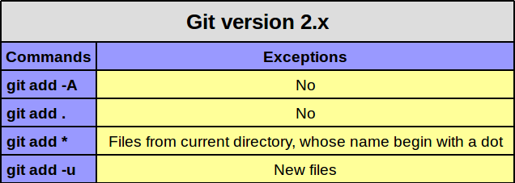

## 关于一些git add指令的区别  
	git add -A (--all) Adds everything, so that everything in your folder on disk is represented in the staging area  
	git add . Stages everything, but does not remove files that have been deleted from the disk  
    git add * Stages everything, but not files that begin with a dot & does not remove files that have been deleted from the disk  
	git add -u (--update) Stages only Modified Files, removes files that have been deleted from disk, does not add new  
	git add <file name 1> <file name 2> Adds only certain file(s)   

